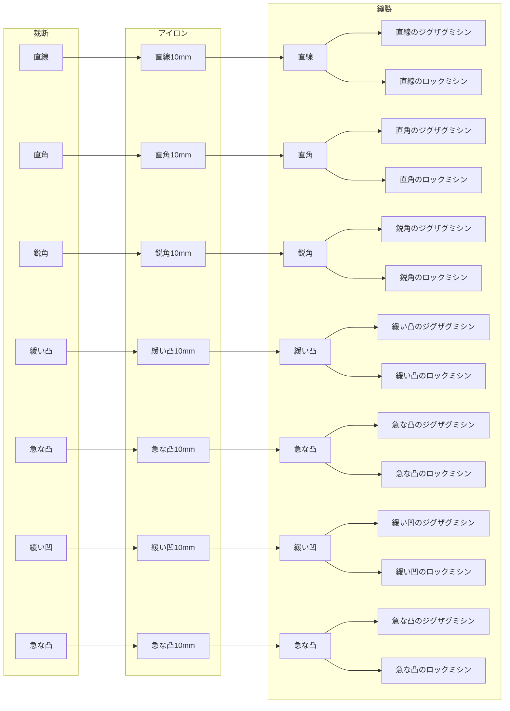

# ミシン1,000本ノックのウェブサイト

## コンセプト

- 型紙をダウンロードできる
- ロードマップがある

## ロードマップ

```mermaid
graph LR;

 subgraph 裁断
  cutting_straight-line[直線]
  cutting_90deg[直角]
  cutting_30deg[鋭角]
  cutting_loose-convex[緩い凸]
  cutting_tight-convex[急な凸]
  cutting_loose-concave[緩い凹]
  cutting_tight-concave[急な凸]
 end

 subgraph アイロン
  ironing10_straight-line[直線10mm]
  ironing10_90deg[直角10mm]
  ironing10_30deg[鋭角10mm]
  ironing10_loose-convex[緩い凸10mm]
  ironing10_tight-convex[急な凸10mm]
  ironing10_loose-concave[緩い凹10mm]
  ironing10_tight-concave[急な凸10mm]
 end

 subgraph 縫製
  sewing_normal_straight-line[直線]
  sewing_normal_90deg[直角]
  sewing_normal_30deg[鋭角]
  sewing_normal_loose-convex[緩い凸]
  sewing_normal_tight-convex[急な凸]
  sewing_normal_loose-concave[緩い凹]
  sewing_normal_tight-concave[急な凸]

  sewing_zigzag_straight-line[直線のジグザグミシン]
  sewing_zigzag_90deg[直角のジグザグミシン]
  sewing_zigzag_30deg[鋭角のジグザグミシン]
  sewing_zigzag_loose-convex[緩い凸のジグザグミシン]
  sewing_zigzag_tight-convex[急な凸のジグザグミシン]
  sewing_zigzag_loose-concave[緩い凹のジグザグミシン]
  sewing_zigzag_tight-concave[急な凸のジグザグミシン]

  sewing_lock_straight-line[直線のロックミシン]
  sewing_lock_90deg[直角のロックミシン]
  sewing_lock_30deg[鋭角のロックミシン]
  sewing_lock_loose-convex[緩い凸のロックミシン]
  sewing_lock_tight-convex[急な凸のロックミシン]
  sewing_lock_loose-concave[緩い凹のロックミシン]
  sewing_lock_tight-concave[急な凸のロックミシン]

  sewing_normal_straight-line ---> sewing_zigzag_straight-line
  sewing_normal_90deg ---> sewing_zigzag_90deg
  sewing_normal_30deg ---> sewing_zigzag_30deg
  sewing_normal_loose-convex ---> sewing_zigzag_loose-convex
  sewing_normal_tight-convex ---> sewing_zigzag_tight-convex
  sewing_normal_loose-concave ---> sewing_zigzag_loose-concave
  sewing_normal_tight-concave ---> sewing_zigzag_tight-concave

  sewing_normal_straight-line ---> sewing_lock_straight-line
  sewing_normal_90deg ---> sewing_lock_90deg
  sewing_normal_30deg ---> sewing_lock_30deg
  sewing_normal_loose-convex ---> sewing_lock_loose-convex
  sewing_normal_tight-convex ---> sewing_lock_tight-convex
  sewing_normal_loose-concave ---> sewing_lock_loose-concave
  sewing_normal_tight-concave ---> sewing_lock_tight-concave
 end

cutting_straight-line ---> ironing10_straight-line ---> sewing_normal_straight-line
cutting_90deg ---> ironing10_90deg ---> sewing_normal_90deg
cutting_30deg ---> ironing10_30deg ---> sewing_normal_30deg
cutting_loose-convex ---> ironing10_loose-convex ---> sewing_normal_loose-convex
cutting_tight-convex ---> ironing10_tight-convex ---> sewing_normal_tight-convex
cutting_loose-concave ---> ironing10_loose-concave ---> sewing_normal_loose-concave
cutting_tight-concave ---> ironing10_tight-concave ---> sewing_normal_tight-concave

```
